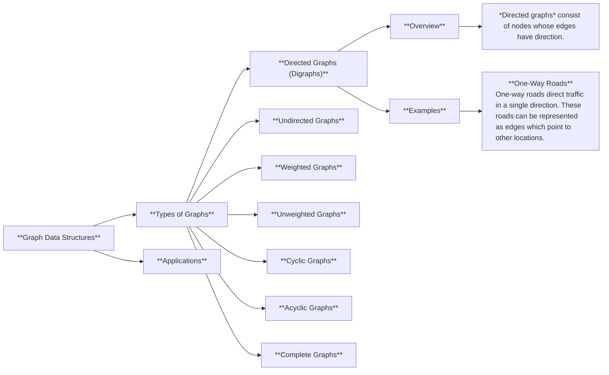

```mermaid
flowchart LR
gds["**Graph Data Structures**"]

gtype["**Types of Graphs**"]

gdir["**Directed Graphs (Digraphs)**"]
gdirov["**Overview**"]
gdirovtxt["*Directed graphs* consist of nodes whose edges have direction."]
gdirov-->gdirovtxt

gdirex["**Examples**"]
gdirex1["**One-Way Roads**
<p style='text-align:left;'>One-way roads direct traffic in a single direction. These roads can be represented as edges which point to other locations.</p>"]
gdirex-->gdirex1

gdir-->gdirov & gdirex

gundir["**Undirected Graphs**"]
gwe["**Weighted Graphs**"]
gunwe["**Unweighted Graphs**"]
gcyc["**Cyclic Graphs**"]
gacyc["**Acyclic Graphs**"]
gcom["**Complete Graphs**"]

gapp["**Applications**"]

gds-->gtype & gapp
gtype-->gdir & gundir & gwe & gunwe & gcyc & gacyc & gcom
```