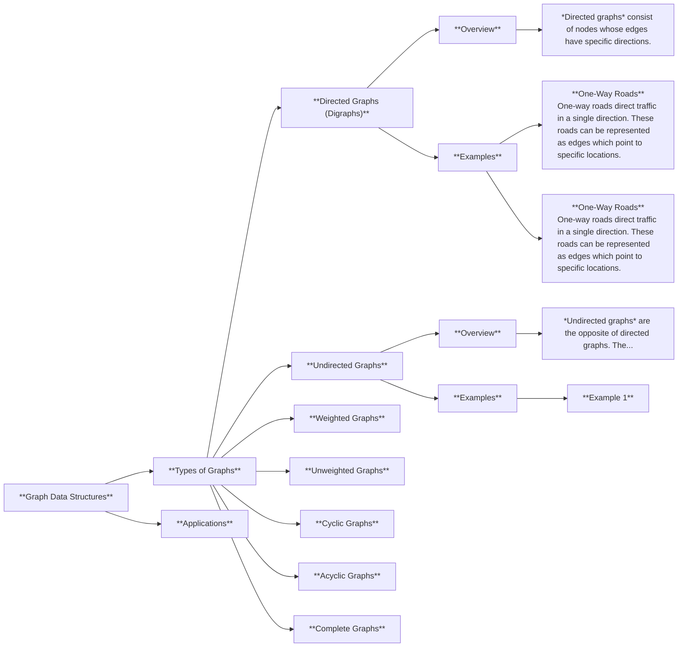

```mermaid
flowchart LR
gds["**Graph Data Structures**"]
gtype["**Types of Graphs**"]

gdir["**Directed Graphs (Digraphs)**"]
gdirov["**Overview**"]
gdirovtxt["*Directed graphs* consist of nodes whose edges have specific directions."]
gdir-->gdirov-->gdirovtxt

gdirex["**Examples**"]
gdirex1["**One-Way Roads**
<p style='text-align:left;'>One-way roads direct traffic in a single direction. These roads can be represented as edges which point to specific locations.</p>"]
gdirex2["**One-Way Roads**
<p style='text-align:left;'>One-way roads direct traffic in a single direction. These roads can be represented as edges which point to specific locations.</p>"]
gdir-->gdirex-->gdirex1 & gdirex2

gundir["**Undirected Graphs**"]
gundirov["**Overview**"]
gundirovtxt["*Undirected graphs* are the opposite of directed graphs. The..."]
gundir-->gundirov-->gundirovtxt

gundirex["**Examples**"]
gundirex1["**Example 1**"]
gundir-->gundirex-->gundirex1

gwe["**Weighted Graphs**"]
gunwe["**Unweighted Graphs**"]
gcyc["**Cyclic Graphs**"]
gacyc["**Acyclic Graphs**"]
gcom["**Complete Graphs**"]

gapp["**Applications**"]

gds-->gtype & gapp
gtype-->gdir & gundir & gwe & gunwe & gcyc & gacyc & gcom
```