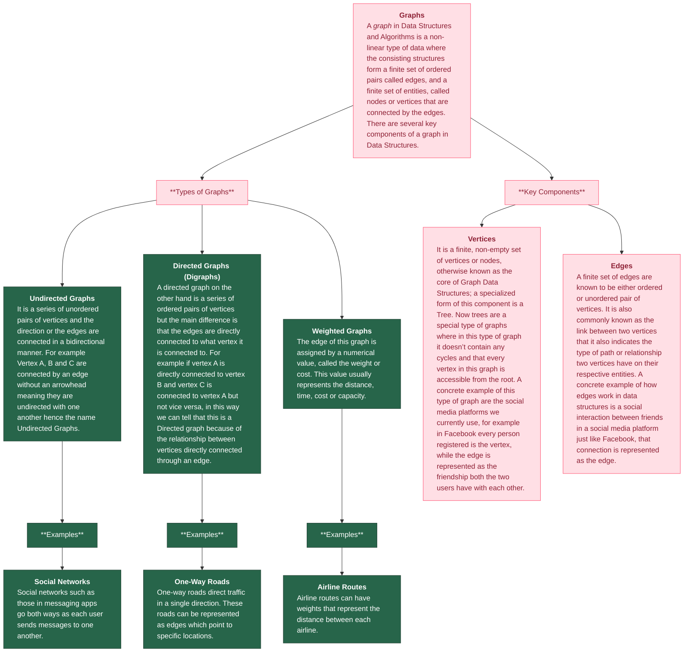

```mermaid
---
config:
  layout: dagre
---
flowchart TB
    gdirex["**Examples**"] --> gdirex2@{ label: "**One-Way Roads**\n<p style=\"text-align:left;\">One-way roads direct traffic in a single direction. These roads can be represented as edges which point to specific locations.</p>" }
    gtype["**Types of Graphs**"] --> n5@{ label: "**Undirected Graphs**\n<p style=\"text-align:left;\">It is a series of unordered pairs of vertices and the direction or the edges are connected in a bidirectional manner. For example Vertex A, B and C are connected by an edge without an arrowhead meaning they are undirected with one another hence the name Undirected Graphs.</p>" } & n6@{ label: "**Directed Graphs (Digraphs)**\n<p style=\"text-align:left;\">A directed graph on the other hand is a series of ordered pairs of vertices but the main difference is that the edges are directly connected to what vertex it is connected to. For example if vertex A is directly connected to vertex B and vertex C is connected to vertex A but not vice versa, in this way we can tell that this is a Directed graph because of the relationship between vertices directly connected through an edge.</p>" } & n7@{ label: "**Weighted Graphs**\n<p style=\"text-align:left;\">The edge of this graph is assigned by a numerical value, called the weight or cost. This value usually represents the distance, time, cost or capacity.</p>" }
    n1@{ label: "**Graphs**\n<p style=\"text-align:left;\">A <em>graph</em> in Data Structures and Algorithms is a non-linear type of data where the consisting structures form a finite set of ordered pairs called edges, and a finite set of entities, called nodes or vertices that are connected by the edges. There are several key components of a graph in Data Structures.</p>" } --> gtype & n2["**Key Components**"]
    n2 --> n3@{ label: "**Vertices**\n<p style=\"text-align:left;\">It is a finite, non-empty set of vertices or nodes, otherwise known as the core of Graph Data Structures; a specialized form of this component is a Tree. Now trees are a special type of graphs where in this type of graph it doesn’t contain any cycles and that every vertex in this graph is accessible from the root. A concrete example of this type of graph are the social media platforms we currently use, for example in Facebook every person registered is the vertex, while the edge is represented as the friendship both the two users have with each other.</p>" } & n4@{ label: "**Edges**\n<p style=\"text-align:left;\">A finite set of edges are known to be either ordered or unordered pair of vertices. It is also commonly known as the link between two vertices that it also indicates the type of path or relationship two vertices have on their respective entities. A concrete example of how edges work in data structures is a social interaction between friends in a social media platform just like Facebook, that connection is represented as the edge.</p>" }
    n5 --> gundirex["**Examples**"]
    n6 --> gdirex
    n7 --> n8["**Examples**"]
    n8 --> gdirex1@{ label: "**Airline Routes**\n<p style=\"text-align:left;\">Airline routes can have weights that represent the distance between each airline.</p>" }
    gundirex --> n9@{ label: "**Social Networks**\n<p style=\"text-align:left;\">Social networks such as those in messaging apps go both ways as each user sends messages to one another.</p>" }
    gdirex2@{ shape: rect}
    n5@{ shape: rect}
    n6@{ shape: rect}
    n7@{ shape: rect}
    n1@{ shape: rect}
    n3@{ shape: rect}
    n4@{ shape: rect}
    gdirex1@{ shape: rect}
    n9@{ shape: rect}
     gdirex:::Pine
     gdirex2:::Pine
     gtype:::Rose
     n5:::Pine
     n6:::Pine
     n7:::Pine
     n1:::Rose
     n2:::Rose
     n3:::Rose
     n4:::Rose
     gundirex:::Pine
     n8:::Pine
     gdirex1:::Pine
     n9:::Pine
    classDef Peach stroke-width:1px, stroke-dasharray:none, stroke:#FBB35A, fill:#FFEFDB, color:#8F632D
    classDef Ash stroke-width:1px, stroke-dasharray:none, stroke:#999999, fill:#EEEEEE, color:#000000
    classDef Aqua stroke-width:1px, stroke-dasharray:none, stroke:#46EDC8, fill:#DEFFF8, color:#378E7A
    classDef Sky stroke-width:1px, stroke-dasharray:none, stroke:#374D7C, fill:#E2EBFF, color:#374D7C
    classDef Rose stroke-width:1px, stroke-dasharray:none, stroke:#FF5978, fill:#FFDFE5, color:#8E2236
    classDef Pine stroke-width:1px, stroke-dasharray:none, stroke:#254336, fill:#27654A, color:#FFFFFF
```