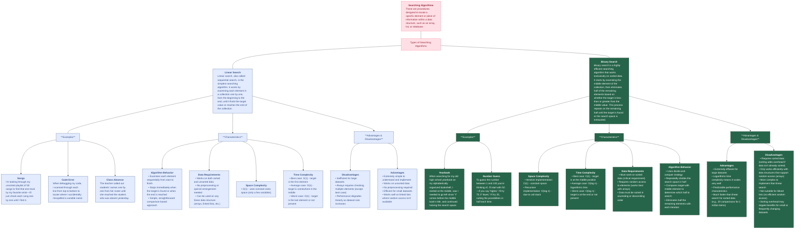

```mermaid
---
config:
  layout: dagre
---
flowchart TB
    sa@{ label: "**Searching Algorithms**\n<p style=\"text-align:left;\">These are procedures designed to locate a specific element or piece of information within a data structure, such as an array, list, or database.</p>" } --- satype["Types of Searching Algorithms"]
    satype --- ls@{ label: "**Linear Search**\n<p style=\"text-align:left;\"><em>Linear search</em>, also called sequential search, is the simplest searching algorithm. It works by examining each element in a collection one by one, from the beginning to the end, until it finds the target value or reaches the end of the collection.</p>" } & bs@{ label: "**Binary Search**\n<p style=\"text-align:left;\"><em>Binary search</em> is a highly efficient searching algorithm that works exclusively on sorted data. It starts by examining the middle element of the collection, then eliminates half of the remaining elements based on whether the target is less than or greater than the middle value. This process repeats on the remaining half until the target is found or the search space is exhausted.</p>" }
    ls --- lsx["**Examples**"]
    bs --- bsx["**Examples**"]
    lsx --> n1@{ label: "**Songs**<br><p style=\"text-align:left;\">I'm looking through my unsorted playlist of 50 songs to find that one track by my favorite artist—I'll just check each song one by one until I find it." } & n2@{ label: "**Code Error**<br><p style=\"text-align:left;\">When debugging my code, I scanned through each line from top to bottom to locate where I accidentally misspelled a variable name</p>" } & n3@{ label: "**Class Absence**<br><p style=\"text-align:left;\">The teacher called out students' names one by one from her roster until she reached the student who was absent yesterday.</p>" }
    bsx --> n4@{ label: "**Yearbook**<br><p style=\"text-align:left;\">When searching for my old high school yearbook on my alphabetically organized bookshelf, I started at the middle, saw I needed to go left since 'Y' comes before the middle book's title, and continued halving the search space.</p>" } & n5@{ label: "**Number Guess**<br><p style=\"text-align:left;\">To guess the number between 1 and 100 you're thinking of, I'll start with 50—if you say 'higher,' I'll try 75; if 'lower,' I'll try 25, cutting the possibilities in half each time.</p>" }
    ls --> n6["**Characteristics**<br>"] & n11["**Advantages &amp; Disadvantages**<br>"]
    n6 --> n7@{ label: "**Algorithm Behavior**<br><p style=\"text-align:left;\">  • Examines each element sequentially from start to finish<br>  • Stops immediately when the target is found or when the end is reached<br>  • Simple, straightforward comparison-based approach</p>" } & n8@{ label: "**Data Requirements**<br><p style=\"text-align:left;\">  • Works on both sorted and unsorted data<br>  • No preprocessing or special arrangement needed<br>  • Can be used on any linear data structure (arrays, linked lists, etc.)</p>" } & n10@{ label: "**Space Complexity**<br><p style=\"text-align:left;\">• O(1) - uses constant extra space (only a few variables)</p>" } & n9@{ label: "**Time Complexity**<br><p style=\"text-align:left;\">  • Best case: O(1) - target is the first element<br>  • Average case: O(n) - target is somewhere in the middle<br>  • Worst case: O(n) - target is the last element or not present</p>" }
    n11 --> n13@{ label: "**Disadvantages**<br><p style=\"text-align:left;\">• Inefficient for large datasets<br>• Always requires checking multiple elements (except best case)<br>• Performance degrades linearly as dataset size increases</p>" } & n12@{ label: "**Advantages**<br><p style=\"text-align:left;\">• Extremely simple to understand and implement<br>• Works on unsorted data<br>• No preprocessing required<br>• Efficient for small datasets<br>• Works well on linked lists where random access isn't available<br><br></p>" }
    bs --> n15["**Characteristics**<br>"] & n14["**Advantages &amp; Disadvantages**<br>"]
    n15 --> n19@{ label: "**Space Complexity**<br><p style=\"text-align:left;\">  • Iterative implementation: O(1) - constant space<br>• Recursive implementation: O(log n) - due to call stack<br><br><br></p>" } & n18@{ label: "**Time Complexity**<br><p style=\"text-align:left;\">  • Best case: O(1) - target is at the middle position<br>• Average case: O(log n) - logarithmic time<br>• Worst case: O(log n) - target is at the end or not present<br><br><br></p>" } & n17@{ label: "**Data Requirements**<br><p style=\"text-align:left;\">  • Must work on sorted data (critical requirement)<br>• Requires random access to elements (works best with arrays)<br>• Data must be sorted in ascending or descending order<br><br><br></p>" } & n16@{ label: "**Algorithm Behavior**<br><p style=\"text-align:left;\">  • Uses divide-and-conquer strategy<br>• Repeatedly divides the search space in half<br>• Compares target with middle element to determine which half to search<br>• Eliminates half the remaining elements with each iteration<br><br></p>" }
    n14 --> n20@{ label: "**Advantages**<br><p style=\"text-align:left;\">  • Extremely efficient for large datasets<br>• Logarithmic time complexity means it scales very well<br>• Predictable performance characteristics<br>• Much faster than linear search for sorted data (e.g., 20 comparisons for 1 million items)<br><br><br></p>" } & n21@{ label: "**Disadvantages**<br><p style=\"text-align:left;\">  • Requires sorted data (sorting adds overhead if data isn't already sorted)<br>• Only works efficiently with data structures that support random access (arrays)<br>• More complex to implement than linear search<br>• Not suitable for linked lists (no efficient random access)<br>• Sorting overhead may negate benefits for small or frequently changing datasets<br><br><br><br></p>" }
    sa@{ shape: rect}
    ls@{ shape: rect}
    bs@{ shape: rect}
    n1@{ shape: rect}
    n3@{ shape: rect}
    n4@{ shape: rect}
    n5@{ shape: rect}
    n6@{ shape: rect}
    n11@{ shape: rect}
    n7@{ shape: rect}
    n8@{ shape: rect}
    n10@{ shape: rect}
    n9@{ shape: rect}
    n13@{ shape: rect}
    n12@{ shape: rect}
    n15@{ shape: rect}
    n14@{ shape: rect}
    n19@{ shape: rect}
    n18@{ shape: rect}
    n17@{ shape: rect}
    n16@{ shape: rect}
    n20@{ shape: rect}
    n21@{ shape: rect}
     sa:::Rose
     satype:::Rose
     ls:::Sky
     bs:::Pine
     lsx:::Sky
     bsx:::Pine
     n1:::Sky
     n2:::Sky
     n3:::Sky
     n4:::Pine
     n5:::Pine
     n6:::Sky
     n11:::Sky
     n7:::Sky
     n8:::Sky
     n10:::Sky
     n9:::Sky
     n13:::Sky
     n12:::Sky
     n15:::Pine
     n14:::Pine
     n19:::Pine
     n18:::Pine
     n17:::Pine
     n16:::Pine
     n20:::Pine
     n21:::Pine
    classDef Sky stroke-width:1px, stroke-dasharray:none, stroke:#374D7C, fill:#E2EBFF, color:#374D7C
    classDef Pine stroke-width:1px, stroke-dasharray:none, stroke:#254336, fill:#27654A, color:#FFFFFF
    classDef Rose stroke-width:1px, stroke-dasharray:none, stroke:#FF5978, fill:#FFDFE5, color:#8E2236
```